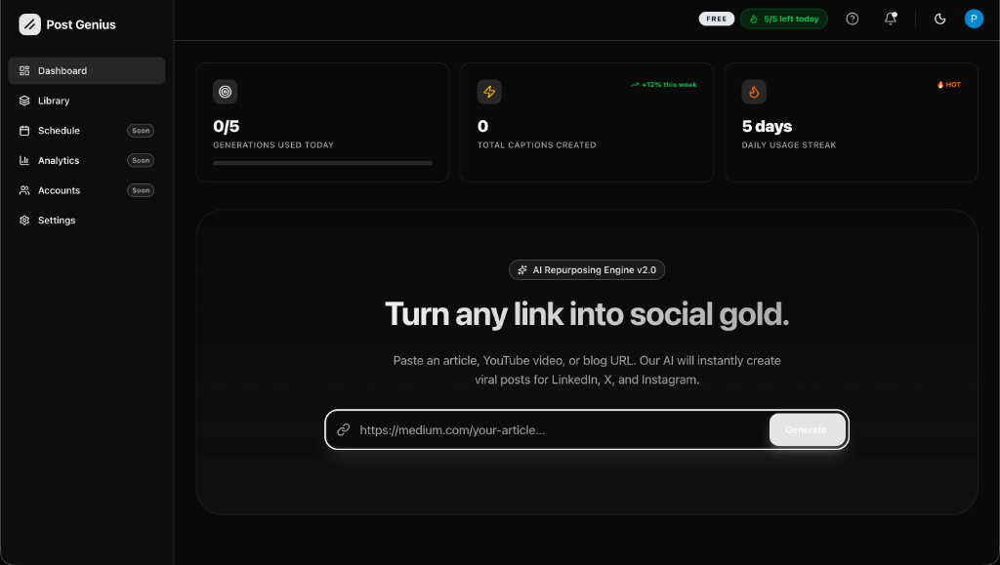

# PostGenius



<div align="center">

**The Ultimate AI-Powered Content Engine.**  
*Transform. Schedule. Grow.*

[](https://nextjs.org/)
[](https://www.typescriptlang.org/)
[](https://supabase.com/)
[](https://clerk.com/)

</div>

---

## 🚀 Overview

**PostGenius** is a state-of-the-art content repurposing platform built to supercharge social media growth. It leverages advanced AI to transform single input sources—like blogs, videos, or raw ideas—into optimized, viral-ready posts for LinkedIn, Twitter (X), Instagram, and Facebook.

Designed with a premium "dark mode first" aesthetic, PostGenius offers a seamless workflow from **Generation** to **Visualization** to **Scheduling**.

## ✨ Key Features

### 🧠 **AI Content Engine**
Powered by **Google Gemini 1.5 Flash**, our engine understands context, tone, and nuance to generate human-quality captions and threads.

### 🎨 **Visual Previews**
See it before you post it. PostGenius renders pixel-perfect previews of how your content will look on:
- **Twitter**: Threads and single tweets.
- **LinkedIn**: Professional posts with "See more" expansions.
- **Instagram**: Feed posts and caption aesthetics.

### 📅 **Smart Scheduler** (Beta)
An integrated calendar system to plan your content strategy weeks in advance. Connect your accounts and let PostGenius handle the rest.

### 📊 **Advanced Analytics**
Track your usage, generation limits, and credit consumption with real-time dashboards and interactive charts.

### 🛡️ **Enterprise-Grade Security**
- **Authentication**: Secure, stateless auth via Clerk.
- **Rate Limiting**: Robust API protection using Upstash Redis.
- **Data Safety**: Row Level Security (RLS) policies in Supabase.

## 🛠️ Tech Stack

This project is built with the modern "T3-like" stack for maximum performance and scalability:

- **Frontend**: Next.js 14 (App Router), Tailwind CSS, Framer Motion, Shadcn/UI
- **Backend**: Next.js Server Actions, Supabase (PostgreSQL)
- **Auth**: Clerk auth
- **AI**: Google Gemini API
- **Utilities**: Lucide React, Sonner, Zod, Recharts

## 💻 Getting Started

### Prerequisites
- Node.js 
- npm 

### Installation

1.  **Clone the repository:**
    ```bash
    git clone https://github.com/pranavgawaii/PostGenius-main.git
    cd PostGenius-main
    ```

2.  **Install dependencies:**
    ```bash
    npm install
    ```

3.  **Configure Environment:**
    Create a `.env.local` file with your credentials (see `.env.example`).

4.  **Run Locally:**
    ```bash
    npm run dev
    ```

## 👨‍💻 Author

**Pranav Gawaii**

- **GitHub**: [@pranavgawaii](https://github.com/pranavgawaii)
- **Role**: Lead Developer & Architect

---

*© 2026 PostGenius. All rights reserved.*
